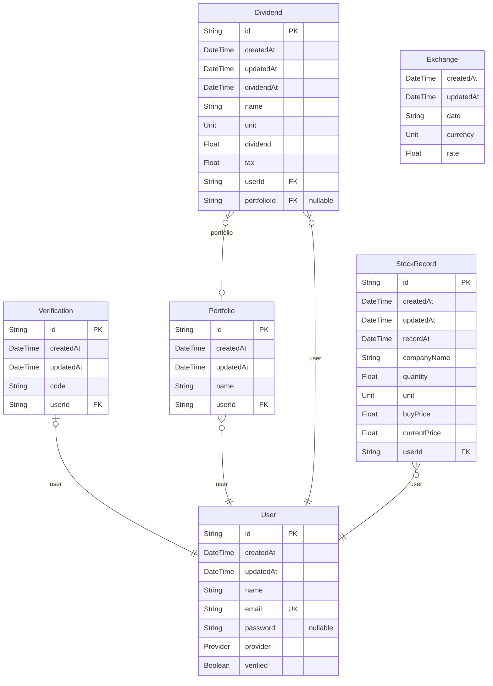

# Rich Diary
> Generated by [`prisma-markdown`](https://github.com/samchon/prisma-markdown)

- [부자일기](#부자일기)

## 부자일기

### `User`

**Properties**
  - `id`: 
  - `createdAt`: 
  - `updatedAt`: 
  - `name`: 
  - `email`: 
  - `password`: Provider가 LOCAL이 아닐 경우 null
  - `provider`: 
  - `verified`: 

### `Verification`

**Properties**
  - `id`: 
  - `createdAt`: 
  - `updatedAt`: 
  - `code`: 
  - `userId`: 

### `Portfolio`

**Properties**
  - `id`: 
  - `createdAt`: 
  - `updatedAt`: 
  - `name`: 
  - `userId`: 

### `Dividend`

**Properties**
  - `id`: 
  - `createdAt`: 
  - `updatedAt`: 
  - `dividendAt`: 
  - `name`: 
  - `unit`: 
  - `dividend`: 
  - `tax`: 
  - `userId`: 
  - `portfolioId`: 

### `StockRecord`

**Properties**
  - `id`: 
  - `createdAt`: 
  - `updatedAt`: 
  - `recordAt`: 
  - `companyName`: 
  - `quantity`: 
  - `unit`: 
  - `buyPrice`: 
  - `currentPrice`: 
  - `userId`: 

### `Exchange`

**Properties**
  - `createdAt`: 
  - `updatedAt`: 
  - `date`: 
  - `currency`: 
  - `rate`: 