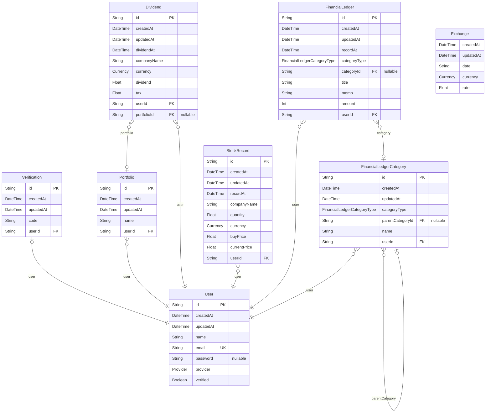

# Rich Diary
> Generated by [`prisma-markdown`](https://github.com/samchon/prisma-markdown)

- [부자일기](#부자일기)

## 부자일기

### `User`
유저

**Properties**
  - `id`: 
  - `createdAt`: 생성일
  - `updatedAt`: 수정일
  - `name`: 이름
  - `email`: 이메일
  - `password`: Provider가 LOCAL이 아닐 경우 null
  - `provider`: 회원가입 경로
  - `verified`: 이메일 인증 여부

### `Verification`
이메일 인증 코드

**Properties**
  - `id`: 
  - `createdAt`: 생성일
  - `updatedAt`: 수정일
  - `code`: 인증코드
  - `userId`: 유저 ID

### `Portfolio`
포트폴리오

**Properties**
  - `id`: 
  - `createdAt`: 생성일
  - `updatedAt`: 수정일
  - `name`: 포트폴리오 이름
  - `userId`: 유저 ID

### `Dividend`
배당일지

**Properties**
  - `id`: 
  - `createdAt`: 생성일
  - `updatedAt`: 수정일
  - `dividendAt`: 배당입금일
  - `companyName`: 회사명
  - `currency`: 화폐단위
  - `dividend`: 배당금
  - `tax`: 세금
  - `userId`: 유저 ID
  - `portfolioId`: 포트폴리오 ID

### `StockRecord`
주식투자기록

**Properties**
  - `id`: 
  - `createdAt`: 생성일
  - `updatedAt`: 수정일
  - `recordAt`: 기록일
  - `companyName`: 회사명
  - `quantity`: 보유주식수
  - `currency`: 화폐 단위
  - `buyPrice`: 구매가
  - `currentPrice`: 현재가
  - `userId`: 유저 ID

### `FinancialLedger`
가계부

**Properties**
  - `id`: 
  - `createdAt`: 생성일
  - `updatedAt`: 수정일
  - `recordAt`: 기록일
  - `categoryType`: 카테고리 유형
  - `categoryId`: 카테고리 ID
  - `title`: 제목
  - `memo`: 메모
  - `amount`: 금액
  - `userId`: 유저 ID

### `FinancialLedgerCategory`
가계부 카테고리

**Properties**
  - `id`: 
  - `createdAt`: 생성일
  - `updatedAt`: 수정일
  - `categoryType`: 카테고리
  - `parentCategoryId`: 부모 카테고리 ID
  - `name`: 이름
  - `userId`: 유저 ID

### `Exchange`
환율

**Properties**
  - `createdAt`: 생성일
  - `updatedAt`: 수정일
  - `date`: 날짜
  - `currency`: 화폐단위
  - `rate`: 환율